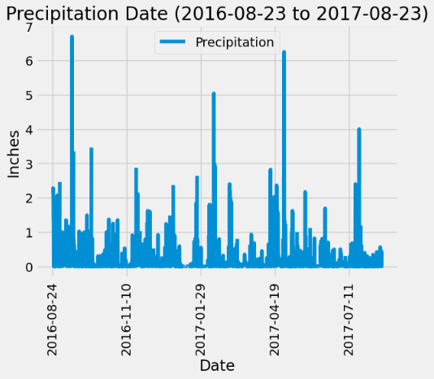
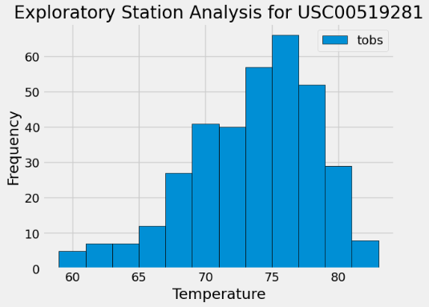

# sqlalchemy-challenge

Module 10 SQLALCHEMY Challenge 

## Description:   

This repo contains the climate_starter jupiter notebook, app python file and resources folder with the .csv and sqlite files for the Module 10 Challenge exploring SQLAlchemy library and its usefulness in dealing with SQL databases and dialects.

## Technologies  

* SQL
* sqlite
* python
* jupiter notebook
* Visual Studio Code

## Data Source  
All files and data used for this challenge were generated by edX Boot Camps LLC, and Mockaroo, LLC.

## Important Documents
* app.py
* climate_starter.ipynb
* hawaii_measurements.csv
* hawaii_stations.csv
* hawaii.sqlite

## Analysis  
My analysis and relevant plots can be found below and within the climate_starter.ipynb file contained herein.

* Exploratory Precipitation Analysis

* Exploratory Station Analysis (for station: USC00519281)

## Contributors
In order to complete this challenge I utilized/relied on:
* Consultations/study sessions with Amanda Baynard.
* Class lesson activities and videos for the 10-SQl module
* Google searches regarding 
* ChatGPT for assistance with debugging where necessary
* Office Hours with Will (instructor) regarding app setup using Flask and assistance with start/end route in app.py

Sources: 
- ChatGPT
- Google searches
- Stack Overflow